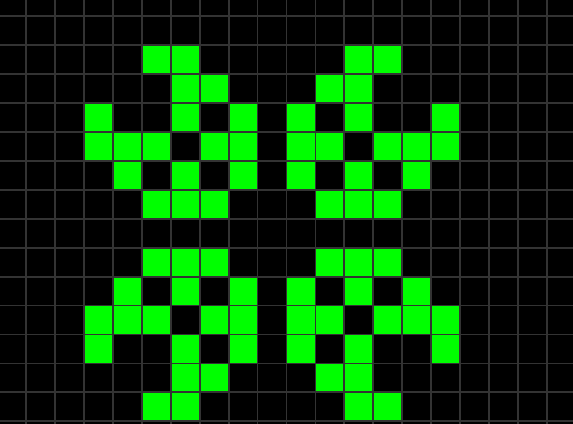

# Conway-Game-of-Life
A C++ & SDL2 implementation of Conway's Game of Life.

# The game

> The **Game of Life**, also known simply as **Life**, is a cellular automaton devised by the British mathematician John Horton Conway in 1970. It is a zero-player game, meaning that its evolution is determined by its initial state, requiring no further input. One interacts with the Game of Life by creating an initial configuration and  observing how it evolves. It is Turing complete and can simulate a universal constructor or any other Turing machine. 
>
> The universe of the Game of Life is an infinite, two-dimensional orthogonal grid of square cells, each of which is in one of two possible states, live or dead (or populated and unpopulated, respectively). Every cell interacts with its eight neighbours, which are the cells that are horizontally, vertically, or diagonally adjacent. At each step in time, the following transitions occur: 
>1. Any live cell with fewer than two live neighbours dies, as if by underpopulation.
>2. Any live cell with two or three live neighbours lives on to the next generation.
>3. Any live cell with more than three live neighbours dies, as if by overpopulation.
>4. Any dead cell with exactly three living neighbours becomes a live cell, as if by reproduction.
>
>The initial pattern constitutes the seed of the system. The first generation is created by applying the above rules simultaneously to every cell in the seed, live or dead; births and deaths occur simultaneously, and the discrete moment at which this happens is sometimes called a tick. Each generation is a pure function of the preceding one. The rules continue to be applied repeatedly to create further generations. 
>-- <cite> [Wikipedia - Conway's Game of Life](https://en.wikipedia.org/wiki/Conway%27s_Game_of_Life)

# The implementation

Even though the game should be played on an infinite grid, this implementation
contains a 32 x 24 grid. The game is split into 2 main states, the first being the setup state, during which the player can click on the grid to setup the state, and the second being the simulation state, during which the cell mutation occurs. The game can be arbitrarily paused, started or reset, and changing the state is possible at all times.

# The controls

- Esc - exits the game.
- S - starts the game.
- R - resets the game.
- P - pauses the game.
- Left click - revives the cell.
- Right click - kills the cell.

---

Example of a game construct.

---

Keep in mind that this is just a learning project, and could be improved further.